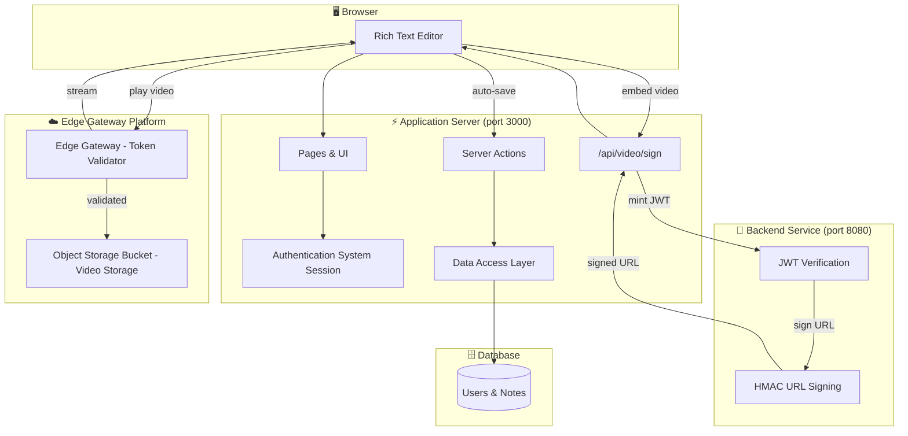
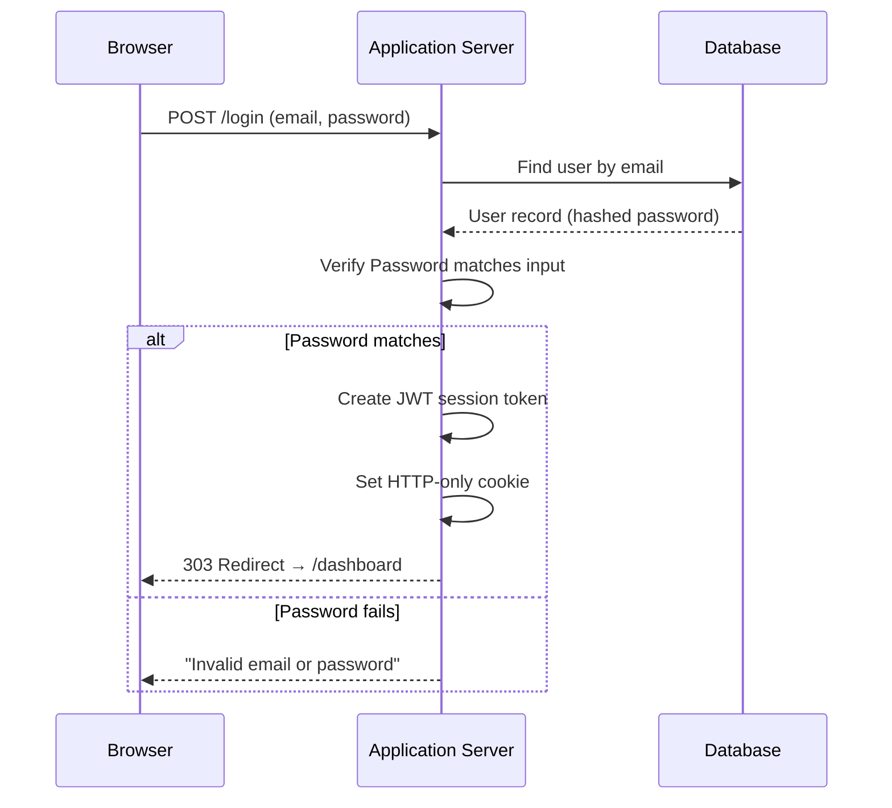
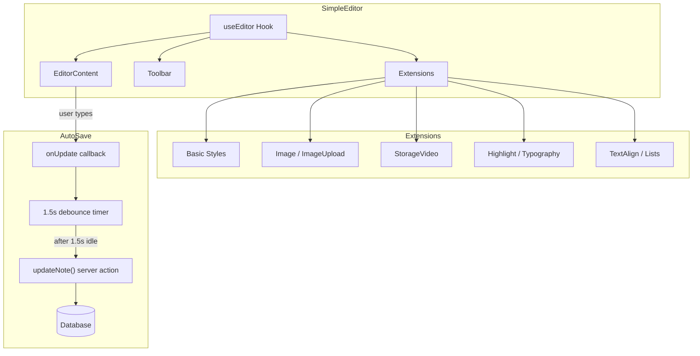
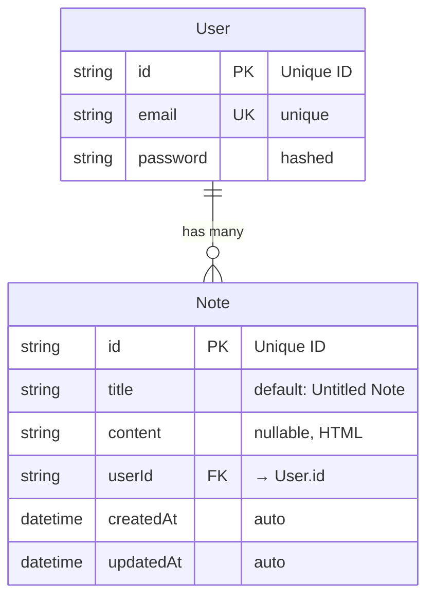

# Editor Project

A full-stack, secure note-taking and e-learning platform with authenticated video streaming. Built with **Application Server**, **Text Editor**, **Backend Service**, **Edge Gateway**, and **Object Storage**.

The core idea: users log in, create rich-text notes with an advanced WYSIWYG editor, and embed videos stored in **Object Storage**. **Videos are only accessible to authenticated users** — raw URLs are useless without a valid, time-limited HMAC token.

---

## 🏗 High-Level Architecture



The system is split into **3 independent services**, each with a single responsibility:

| Service | Port | Tech | Responsibility |
|---------|------|------|---------------|
| **Frontend** | `3000` | Application Server, UI Library, Rich Text Editor | UI, auth, note CRUD, API proxy |
| **Signing Backend** | `8080` | Backend Service | JWT verification, HMAC URL signing |
| **Edge Gateway** | `8787` | Edge Gateway | Token validation, Object Storage video serving |

---

## 📂 Project Structure

```text
my-editor-project/
├── app/                          # Application Server App Router
│   ├── api/
│   │   ├── auth/[...auth]/       #   Authentication System route handler
│   │   └── video/sign/           #   Video signing API proxy (session-gated)
│   ├── dashboard/                #   Notes dashboard (SSR, auth-protected)
│   ├── login/                    #   Login page
│   ├── signup/                   #   Signup page
│   ├── notes/[id]/               #   Note editor page + editor wrapper
│   ├── layout.tsx                #   Root layout
│   └── page.tsx                  #   Root redirect (→ /dashboard or /login)
│
├── actions/                      # UI Library Server Actions
│   ├── auth.ts                   #   loginAction(), registerAction()
│   └── notes.ts                  #   createNote(), updateNote()
│
├── backend/                      # Backend Service
│   ├── main.go                   #   HTTP server entry point
│   ├── auth/jwt.go               #   Real JWT verification
│   ├── handlers/video.go         #   HMAC signing + CORS handler
│   └── go.mod                    #   Backend Service module
│
├── components/
│   ├── editor-node/              #   Custom Rich Text Editor node extensions
│   │   ├── storage-video-node/   #     Object Storage Video node (renders <video> in editor)
│   │   ├── image-upload-node/    #     Drag-and-drop image uploads
│   │   ├── heading-node/         #     Styled headings
│   │   └── ...                   #     blockquote, code-block, list, etc.
│   ├── editor-ui/                #   Toolbar button components
│   │   ├── storage-video-button/ #     Video embed button + useStorageVideo hook
│   │   └── ...                   #     heading, list, mark, link, etc.
│   ├── editor-templates/
│   │   └── simple/               #   SimpleEditor (main editor component)
│   ├── editor-ui-primitive/      #   Base UI primitives (Button, Toolbar)
│   └── editor-icons/             #   SVG icon components
│
├── hooks/                        # Custom UI Library hooks
│   ├── use-editor-instance.ts    #   Editor instance hook
│   ├── use-cursor-visibility.ts  #   Cursor visibility management
│   └── ...                       #   breakpoint, scrolling, window-size, etc.
│
├── lib/                          # Shared utilities
│   ├── auth.ts                   #   Authentication System config
│   ├── database.ts               #   Data Access Layer client (Database adapter)
│   └── editor-utils.ts           #   Image upload handler, size limits
│
├── prisma/
│   └── schema.prisma             #   Database schema (User, Note models)
│
├── worker/                       # Edge Gateway
│   ├── src/index.js              #   Token validation + Object Storage serving + Range support
│   └── config.toml               #   Edge Gateway config (Object Storage binding, HMAC secret)
│
├── .env                          #   Environment variables (secrets, DB URL)
│   └── seed.ts                   #   Database seeder (creates test user)
└── package.json                  #   Frontend dependencies
```

---

## 🔒 Authentication System

### User Authentication (Authentication System)



**How it works:**

1. User submits email + password via `loginAction()` server action
2. Authentication System's `authorize()` callback queries Database via Data Access Layer
3. Password is verified using a hashing algorithm
4. On success, Authentication System creates a **JWT session token** stored in an **HTTP-only cookie**
5. The JWT contains the user's `id` (added via custom `jwt` and `session` callbacks)
6. Every protected page calls `auth()` server-side to validate the session

**Session flow through the app:**
```
/ (root) → auth() → session exists? → /dashboard : /login
/dashboard → auth() → no session? → redirect /login
/notes/[id] → auth() → no session? → redirect /login
/api/video/sign → auth() → no session? → 401 Unauthorized
```

### Password Storage

```
User types: "mypassword"
        ↓
hash("mypassword")  →  "hashed_string"  (stored in DB)
        ↓
Login: verify("mypassword", "hashed_string")  →  true ✅
```

Passwords are **never stored in plaintext**. The system uses a secure, adaptive hashing algorithm.

---

## 🎥 Secure Video Streaming Architecture

This is the heart of the project. The goal: **only authenticated users can watch videos, even if someone shares the raw video URL.**

### The Complete Video Flow

```mermaid
sequenceDiagram
    participant User as 👤 User (Browser)
    participant App as ⚡ Application Server API
    participant Backend as 🔧 Backend Service
    participant Gateway as ☁️ Edge Gateway
    participant Storage as 📦 Object Storage

    Note over User: User clicks Video icon in editor
    User->>User: Prompt: "Enter video path"
    User->>App: GET /api/video/sign?path=videos/lesson.mp4
    Note over App: Cookie sent automatically

    rect rgb(40, 40, 80)
        Note over App: Step 1: Session Gate
        App->>App: auth() — validate Authentication System session
        alt No session
            App-->>User: 401 Unauthorized
        end
    end

    rect rgb(40, 80, 40)
        Note over App: Step 2: Mint Inter-Service JWT
        App->>App: Sign JWT {sub: userId, exp: 60s}
        App->>App: Using BACKEND_JWT_SECRET
    end

    rect rgb(80, 40, 40)
        Note over Backend: Step 3: Verify & Sign
        App->>Backend: GET /api/video/sign?path=... + Bearer JWT
        Backend->>Backend: Verify JWT
        alt Invalid/expired JWT
            Backend-->>App: 401 Unauthorized
        end
        Backend->>Backend: HMAC-SHA256 sign: "videos/lesson.mp4:expiry"
        Backend->>Backend: Using VIDEO_HMAC_SECRET
        Backend->>Backend: Base64URL encode token
        Backend-->>App: { url: "gateway-domain/videos/lesson.mp4?token=abc123" }
    end

    App-->>User: { url: "...?token=abc123" }
    User->>User: Insert <video src="...?token=abc123">

    rect rgb(80, 60, 20)
        Note over Gateway: Step 4: Token Validation at Edge
        User->>Gateway: GET /videos/lesson.mp4?token=abc123
        Gateway->>Gateway: Decode Base64URL token
        Gateway->>Gateway: Extract: path + expiry + signature
        Gateway->>Gateway: Verify path matches request
        Gateway->>Gateway: Verify not expired
        Gateway->>Gateway: Recompute HMAC-SHA256 with SECRET_KEY
        Gateway->>Gateway: Compare signatures (constant-time)
        alt Token invalid
            Gateway-->>User: 401 Unauthorized
        end
    end

    rect rgb(20, 60, 80)
        Note over Storage: Step 5: Serve from Object Storage
        Gateway->>Storage: GET("videos/lesson.mp4")
        alt File not found
            Gateway-->>User: 404 Not Found
        end
        Storage-->>Gateway: Video binary stream
        Gateway-->>User: 200 OK (video/mp4) + Range support
    end

    Note over User: Video plays in editor ▶️
```



### Why 3 Services?

| Layer | Why it exists |
|-------|--------------|
| **Application Server API** `/api/video/sign` | **Session boundary** — only place that has access to Authentication System cookies. Keeps the browser from ever knowing any secrets. |
| **Backend Service** `/api/video/sign` | **Crypto performance** — HMAC signing in Backend Service is highly efficient. Decoupled so it can scale independently. |
| **Edge Gateway** | **Edge validation** — runs in data centers worldwide. Validates tokens with minimum latency. Serves video from Object Storage without hitting your origin server. |

### What Each Secret Does


| Secret | Shared Between | Purpose |
|--------|---------------|---------|
| `AUTH_SECRET` | Application Server only | Encrypts Authentication System session cookies |
| `BACKEND_JWT_SECRET` | App Server ↔ Backend | Signs inter-service JWTs (60s lifetime) |
| `VIDEO_HMAC_SECRET` | Backend ↔ Gateway | Signs video URLs with HMAC-SHA256 (15min lifetime) |

### HMAC Token Structure

```
Token = Base64URL( "video/path:expiry_timestamp:hmac_signature" )

Example decoded:
  Path:      videos/lesson-1.mp4
  Expiry:    1711411200 (Unix timestamp, 15 min from now)
  Signature: a3f8c2...9d1e (HMAC-SHA256 of "videos/lesson-1.mp4:1711411200")
```

The Edge Gateway recomputes the HMAC independently. If the signature matches and the timestamp hasn't expired, the video is served. The token is **path-bound** — a token for `lesson-1.mp4` cannot be used to access `lesson-2.mp4`.

---

## ✏️ Editor & Auto-Save System

### Rich Text Editor Architecture



**How auto-save works:**

1. Every keystroke triggers the Rich Text Editor's `onUpdate` callback
2. The callback resets a **1.5-second debounce timer**
3. After 1.5s of no typing, the callback fires `updateNote(noteId, html)`
4. `updateNote` is a UI Library Server Action that:
   - Validates the Authentication System session
   - Checks the user owns the note (`userId` match)
   - Updates the `content` column via Data Access Layer
5. On next page load, `initialContent` is passed from the server to the editor

### Custom Rich Text Editor Extensions

| Extension | Type | What it does |
|-----------|------|-------------|
| `StorageVideo` | Node | Renders a `<video>` element with `data-type="storage-video"`. Stores `src` attribute (the signed URL). |
| `ImageUploadNode` | Node | Drag-and-drop image upload with progress indicator. |
| `HorizontalRule` | Node | Custom styled `<hr>` element. |
| `StarterKit` | Bundle | Headings, paragraphs, bold, italic, strike, code, blockquote, lists. |
| `Highlight` | Mark | Multi-color text highlighting. |
| `TextAlign` | Extension | Left, center, right, justify alignment. |

---

## 🗄 Database Schema



**Cascade delete**: When a user is deleted, all their notes are deleted too (`onDelete: Cascade`).

---

## 📦 Key Component Roles

### Frontend (Application Server)

| Component | Responsibility |
|---------|---------|
| `next` | React framework (SSR, API routes, App Router) |
| `react` | UI library |
| `editor-core` | Headless WYSIWYG editor |
| `editor-extensions` | Core editor extensions bundle |
| `auth-system` | Authentication (credentials + JWT sessions) |
| `data-access` | Database ORM |
| `hashing-lib` | Password hashing |
| `token-lib` | JWT signing for inter-service auth |

### Backend (Backend Service)

| Component | Purpose |
|---------|---------|
| `http-server` | HTTP server |
| `crypto-lib` | HMAC-SHA256 URL signing |
| `token-verification` | JWT parsing and verification |

### Edge Gateway

| Component | Purpose |
|------|---------|
| `gateway-cli` | CLI for Gateway dev/deploy |
| `crypto-api` | HMAC-SHA256 token verification |

---

## 🛠 How to Run Locally

### Prerequisites
- Node.js runtime environment
- Backend Service runtime environment
- Database instance
- Edge Cloud account (for Object Storage + Edge Gateway)

### 1. Database Setup

Create an environment configuration file in the project root:

```env
# Database
DATABASE_URL="database-connection-string"

# Authentication System session encryption
AUTH_SECRET="<generate-secure-random-string>"

# Inter-service JWT signing (shared)
BACKEND_JWT_SECRET="<generate-secure-random-string>"

# Video URL HMAC signing (shared)
VIDEO_HMAC_SECRET="<generate-secure-random-string>"
```

Apply the schema:
```bash
package-runner data-access db push
```

Seed a test user:
```bash
package-runner script-runner seed.ts
```

### 2. Start All 3 Services

**Terminal 1 — Application Server Frontend:**
```bash
package-manager install
package-manager run dev
```

**Terminal 2 — Backend Service** (needs env vars):
```bash
cd backend
BACKEND_JWT_SECRET="your-secret-here" \
VIDEO_HMAC_SECRET="your-hmac-secret-here" \
backend-runtime run main.go
```

**Terminal 3 — Edge Gateway:**
```bash
cd gateway
gateway-cli dev
```

### 3. Configure Object Storage

1. Create a storage bucket in your cloud dashboard
2. Upload video files (e.g., `videos/sample_video.mp4`)
3. Update gateway configuration:
   ```toml
   [[storage_buckets]]
   binding = "MY_BUCKET"
   bucket_name = "your-bucket-name"
   ```

---

## 🎯 Testing the Workflow

1. Navigate to the login page on your local Application Server
2. Log in with test credentials
3. Click **+ New Note** on the dashboard
4. Type some content — it **auto-saves** after 1.5s of idle
5. Click the **📹 Video icon** in the toolbar
6. Enter a video path from your Object Storage (e.g., `videos/sample_video.mp4`)
7. The video should embed and play in the editor

### Verify Security

Open a private browsing window and try:

| Test | Expected Result |
|------|----------------|
| Visit the signing API directly | `401 Unauthorized` (no session) |
| Visit a video path directly on the Gateway | `401 Unauthorized` (no token) |
| Visit a video path with an invalid token | `401 Unauthorized` (invalid token) |
| Wait 15+ minutes, try a previously valid signed URL | `401 Unauthorized` (expired) |

---

## 🚀 Deployment

### Edge Gateway
Deploy the gateway logic to your edge infrastructure platform.

### Backend Service
Build a static binary and deploy to your preferred server environment.

### Application Server
Deploy to your application hosting provider or self-host the application build.

> **Production checklist:**
> - [ ] Set production values for `AUTH_SECRET`, `BACKEND_JWT_SECRET`, `VIDEO_HMAC_SECRET`
> - [ ] Secure the Gateway master key in your provider's secret storage
> - [ ] Configure CORS settings to your production domain
> - [ ] Update Gateway allowed domains
